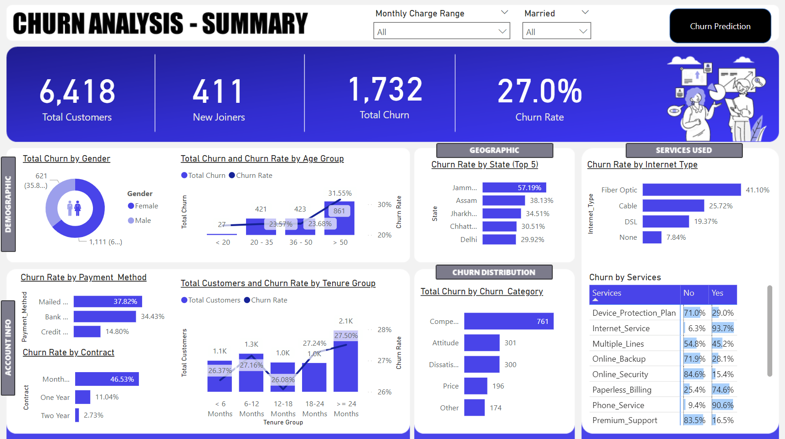
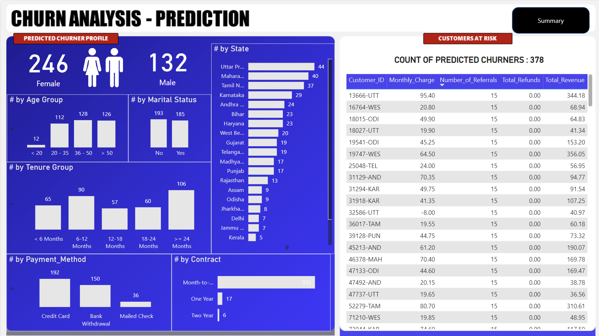

# Churn Analysis and Prediction Using Power BI, SQL, and Machine Learning

## Table of Contents
- [Overview](#overview)
- [Project Goals](#project-goals)
- [Data](#data)
- [Process and Methodology](#process-and-methodology)
  - [ETL Process in SQL](#etl-process-in-sql)
  - [Data Exploration](#data-exploration)
  - [Power Query Transformations](#power-query-transformations)
  - [Machine Learning Model](#machine-learning-model)
- [Power BI Dashboards](#power-bi-dashboards)
  - [Churn Analysis - Summary](#churn-analysis---summary)
  - [Churn Prediction Dashboard](#churn-prediction-dashboard)
- [Key Insights](#key-insights)
- [Technologies Used](#technologies-used)

## Overview
This project demonstrates a comprehensive end-to-end Churn Analysis and Prediction process using Power BI for visualization, SQL for data manipulation, and Python for machine learning. The goal is to analyze customer churn behavior, identify patterns, and build a predictive model to forecast future churners. This project is suitable for telecom firms and adaptable for any industry dealing with customer retention challenges.

## Project Goals
- Analyze customer churn patterns using data on demographics, geography, services, and account details.
- Predict future churners using a Random Forest model, allowing the business to proactively retain customers.
- Create interactive Power BI dashboards that provide actionable insights and facilitate decision-making.

## Data
The dataset includes customer demographic information, services used, payment details, and churn status. Data was extracted, transformed, and loaded (ETL) using SQL Server and Power Query in Power BI before applying machine learning models.

## Process and Methodology

### ETL Process in SQL
1. **Data Loading**: Imported the customer data from a CSV file into SQL Server using the import wizard, with transformations applied as needed for data consistency.
    ```sql
    BULK INSERT Sales_Data
    FROM 'c:\sales_data.csv'
    WITH (FIELDTERMINATOR = ',', ROWTERMINATOR = '\n');
    ``` 

2. **Data Cleaning and Transformation**: Removed null values and handled missing data using SQL's ISNULL function.
    ```sql
    UPDATE Sales_Data
    SET [Customer_ID] = ISNULL([Customer_ID], 0),
        [Title] = ISNULL([Title], 'N/A'),
        [Marital_Status] = ISNULL([Marital_Status], 'N/A')
    WHERE Customer_ID is NULL;
    ```

3. **Views for Power BI**
Created views in SQL Server for easy integration with Power BI dashboards:
    ```
    -- Create VIEW: v_ChurnedViews as Customer_Status for easy integration with Power BI dashboards.
    CREATE VIEW v_ChurnedViews AS
    SELECT Customer_ID, ChurnedStatus_in_SQLServer_Terminology AS 'Churned', Stayed AS 'Stay'
    FROM dbo.Customer_Data;
    ```

## Data Exploration(EDA)
Performed Exploratory Data Analysis (EDA) in SQL by checking for distinct values and nulls across various columns, such as Gender, State, Customer_Status, and Contract.

    ```
    SELECT COUNT(DISTINCT Customer_ID) as TotalCustomers,
           COUNT(DISTINCT Gender) as TotalGender,
           COUNT(DISTINCT Marital_Status) as TotalMaritalStatus,
           SUM(CASE WHEN ChurnedStatus_in_SQLServer_Terminology = 1 THEN 1 ELSE 0 END) as ChurnedCustomers,
           SUM(CASE WHEN Stayed = 1 THEN 1 ELSE 0 END) as StayedCustomers
    FROM dbo.Customer_Data;
    ```

## Power Query Transformations
Power Query was used for additional transformations after loading the data from SQL Server into Power BI.

## 1. New Column: Churn Status
 Created a new `Churn_Status` column: 1 for churned customers and 0 otherwise.
```
Churn_Status = if [Customer_Status] = "Churned" then 1 else 0
```
## 2. Binning
Grouped Monthly_Charges into predefined ranges for better analysis of customer billing behavior.
```
Monthly_Charge_Range = if [Monthly_Charge] < 20 then "<20" else if [Monthly_Charge] < 60 then "20-59" else "60+"
```
## 3. Grouping by Age and Tenure
Created age and tenure groups for easier segmentation of customer data.
```
Age_Group = if [Age] < 20 then "<20" else if [Age] < 36 then "20-35" else if [Age] < 50 then "36-49" else "50+"
```
## 4. Unpivoting
Unpivoted service-related columns to make the data more accessible for analysis.

---


## Machine Learning Model

We used a **Random Forest** classifier to predict customer churn based on the features available in the dataset. Here are the steps we followed to develop and evaluate the model:

### Steps Performed:
1. **Data Preprocessing**: 
   - Irrelevant columns were removed.
   - Categorical columns were encoded to numerical values for compatibility with the Random Forest algorithm.

2. **Data Splitting**:
   - The dataset was split into training and testing sets to evaluate model performance.

3. **Model Training**:
   - The Random Forest model was trained on the training dataset with various customer-related features, such as **contract type**, **monthly charges**, **total revenue**, and others.

4. **Model Evaluation**:
   - After training, the model was evaluated on the test data using metrics such as **accuracy**, **precision**, **recall**, and **F1-score**.
   - The feature importance plot was generated to analyze which features had the highest impact on customer churn predictions.

### Results:
- **Confusion Matrix**:
  
  
- **Classification Report**:
  
  | Metric            |  Precision  |  Recall  |  F1-Score  | Support  |
  |-------------------|-------------|----------|------------|----------|
  | Class 0 (Stayed)  |  0.86       |  0.92    |  0.89      | 847      |
  | Class 1 (Churned) |  0.78       |  0.65    |  0.71      | 355      |
  
  **Overall Accuracy**: 0.84  
  **Weighted Average Precision**: 0.84  
  **Weighted Average Recall**: 0.84  
  **Weighted Average F1-Score**: 0.84

- **Feature Importance**:
  

  The most important features influencing customer churn were:
  - **Contract Type**
  - **Total Revenue**
  - **Total Charges**
  - **Monthly Charges**
  - **Total Long Distance Charges**
  - **Tenure in Months**

These features played a crucial role in identifying customers likely to churn.

---

## Power BI Dashboards

### Churn Analysis - Summary
The **Churn Analysis - Summary** dashboard provides a comprehensive overview of customer churn across various dimensions such as demographics, services used, contract type, and geographic regions. This dashboard is crucial for understanding the historical patterns of customer churn and identifying key trends.

#### Key Metrics:
- **Total Customers**: 6,418
- **New Joiners**: 411
- **Total Churn**: 1,732
- **Churn Rate**: 27.0%

#### Visuals:
1. **Churn by Gender**: A pie chart that shows the distribution of churn across male and female customers.
2. **Churn by Age Group**: A bar chart representing churn by different age groups.
3. **Churn by Payment Method and Contract Type**: This shows how the churn rate varies based on the payment method (e.g., credit card, bank withdrawal) and the contract type (monthly, yearly).
4. **Churn by Geography**: A state-wise breakdown of churn, helping to pinpoint regions with higher churn rates.
5. **Churn by Services**: Analysis of churn based on the services customers subscribe to, such as **Internet Service**, **Device Protection Plan**, etc.


### Churn Prediction Dashboard
The **Churn Prediction dashboard** visualizes the results of the machine learning model, showing the customers likely to churn based on various features. It also helps the business focus on retaining customers at risk.

#### Key Features:
1. **Predicted Churner Profiles**: Displays predicted churners by demographic categories, such as gender, age group, tenure, and state.
2. **At-Risk Customers**: A detailed table of customers predicted to churn. This table provides critical information such as Monthly Charges, Total Revenue, and Number of Referrals.
3. **Filters**: Interactive filters for selecting customers by various attributes (e.g., contract type, state, services used) to drill down on insights.


---
## Key Insights
- **High Churn Segments**: 
  - Customers with **monthly contracts** and shorter tenures (less than 6 months) are more likely to churn. This suggests the need for initiatives to increase customer retention by offering more attractive long-term contracts and improving early customer engagement.
  
- **Service-Driven Churn**:
  - Customers subscribed to **fiber optic internet** and **premium support services** have lower churn rates compared to others. Offering more of these services or upgrading existing customer plans to include these may help retain customers.

- **Geographic Trends**:
  - States like **Jammu & Kashmir** and **Uttar Pradesh** have significantly higher churn rates than other regions. This indicates potential areas for focused marketing campaigns or service improvements to reduce churn.

- **Feature Importance in Predictions**:
  - The top features contributing to churn predictions are **contract type**, **total revenue**, **monthly charges**, and **total long-distance charges**. These insights help target retention strategies more effectively by focusing on high-impact features.

---

## Technologies Used
- **SQL Server**: Used for ETL (Extract, Transform, Load) operations, data cleaning, and exploration.
- **Power BI**: Used for data visualization and dashboard creation, allowing interactive exploration of customer churn data.
- **Python (scikit-learn)**: Used to build a **Random Forest** model to predict customer churn and evaluate model performance using various metrics.
- **Random Forest Algorithm**: A machine learning model used to identify key factors driving customer churn and predict which customers are likely to churn in the future.


